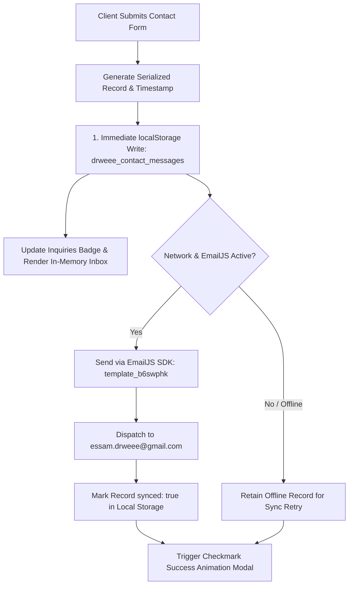

# DR.WEEE — Sovereign Circular Systems & Technology Platform

<div align="center">


[](https://www.drweee.com)
[](readme/STYLE_DIRECTION.md)
[_•_IT-17634e?style=for-the-badge&logo=translate&logoColor=ffffff)](locales/)
[](vercel.json)
[](public-certificate.html)

<br>

**"Technology has a second life. If it cannot be measured, audited, and verified, it does not count."**

*Founded in 2018 in Cairo, Egypt by Essam Hashem — Operating across 6 specialized corporate entities and 11+ regional markets across the Middle East, Africa, and Southern Europe.*

</div>

---

## 📑 Table of Contents

- [01 / The Brief & Architectural Philosophy](#01--the-brief--architectural-philosophy)
- [02 / Full Feature Suite & Platform Hubs](#02--full-feature-suite--platform-hubs)
- [03 / 2026 Industrial Circular-Tech Design System](#03--2026-industrial-circular-tech-design-system)
- [04 / Dual-Dispatch Contact Engine & EmailJS](#04--dual-dispatch-contact-engine--emailjs)
- [05 / Tri-Lingual Localization System (EN • AR • IT)](#05--tri-lingual-localization-system-en--ar--it)
- [06 / Progressive Web App (PWA) & Offline Suite](#06--progressive-web-app-pwa--offline-suite)
- [07 / Audited Telemetry, Analytics & ESG Governance](#07--audited-telemetry-analytics--esg-governance)
- [08 / Deployment & Infrastructure (Vercel & Local)](#08--deployment--infrastructure-vercel--local)
- [09 / Repository Architecture & Directory Map](#09--repository-architecture--directory-map)
- [10 / Security, Privacy & Compliance Standards](#10--security-privacy--compliance-standards)

---

## 01 / The Brief & Architectural Philosophy

DR.WEEE operates at the convergence of **sovereign heavy mechanical engineering**, **enterprise data sanitization**, and **audited circular commodities**. Unlike conventional recycling platforms, DR.WEEE manufactures heavy industrial shredders locally in Egypt, operates certified hydrometallurgical recovery labs, and delivers mathematically verifiable ESG impact reports for Fortune 500 multinationals, banks, and telecom providers.

### Core Architectural Pillars
```
┌────────────────────────────────────────────────────────────────────────┐
│                      DR.WEEE CORE ARCHITECTURE                         │
│                                                                        │
│  [ Enterprise Ingestion ] ──> [ NIST 800-88 Sanitization ]            │
│            │                               │                           │
│            ▼                               ▼                           │
│  [ Sovereign Shredding ]  ──> [ Hydrometallurgical Refining ]          │
│            │                               │                           │
│            ▼                               ▼                           │
│  [ Secondary Smelting ]   ──> [ Audited ESG Telemetry & Certificate ]  │
└────────────────────────────────────────────────────────────────────────┘
```

- **Zero-Framework High-Performance Baseline**: Instant first contentful paint (< 0.6s), zero client-side bundle bloat, native HTML5/CSS3/ES6+ foundation.
- **Enterprise-Grade Data Security**: Serialized chain-of-custody tracking with digitally verifiable certificates.
- **Sovereign Industrial Manufacturing**: MENA’s first locally engineered smart industrial electronic shredders.
- **Verifiable ESG Impact**: Audited metric tons diverted, carbon offsets calculated, and precious material recovery yields tracked in real time.

---

## 02 / Full Feature Suite & Platform Hubs

The DR.WEEE web platform delivers a cohesive ecosystem of specialized portals, interactive tools, and enterprise verification interfaces:

| Hub / Page | File | Core Features & Operational Purpose |
| :--- | :--- | :--- |
| **Corporate Homepage** | [`index.html`](file:///c:/Users/adham/Downloads/weee%20web/index.html) | Signature tailored hero with live operational telemetry, 4 core capability metrics, 4 material stream breakdowns, sovereign machinery showcase, sector solutions (Banking, Telecom, Enterprise), interactive accordion FAQ, dynamic client logo grid, and regional dispatch CTA. |
| **Enterprise Services Hub** | [`services.html`](file:///c:/Users/adham/Downloads/weee%20web/services.html) | Comprehensive catalog of **11 circular enterprise solutions**, including Secure ITAD, NIST 800-88 Data Destruction, Heavy Industrial Electronics, Telecom Decommissioning, PCB Refining, Toner Neutralization, Smart Shredder Leasing, and EPR Compliance. |
| **Origin & Sovereign Story** | [`about.html`](file:///c:/Users/adham/Downloads/weee%20web/about.html) | Founding journey of Essam Hashem (2018), 6 group operating entities, 11+ regional markets, industrial facility photography (6th of October Industrial Zone), executive leadership profiles, and verified milestone timeline. |
| **Audited ESG Telemetry** | [`impact.html`](file:///c:/Users/adham/Downloads/weee%20web/impact.html) | Audited environmental telemetry console: metric tons diverted, MT CO₂e avoided, MWh saved, material purity splits (42% reuse, 53% secondary refining, 4.8% neutralized, 0.2% inert dust), and 2030 Net-Zero Commitments. |
| **Deep-Dive Ecology** | [`environmental-impact.html`](file:///c:/Users/adham/Downloads/weee%20web/environmental-impact.html) | Scientific ecological impact breakdown, heavy metal toxic leachate prevention (Lead, Mercury, Cadmium), and circular lifecycle carbon payback comparisons. |
| **Operations Dispatch** | [`contact.html`](file:///c:/Users/adham/Downloads/weee%20web/contact.html) | Live dispatch console, categorized inquiry intake (Services, Partnerships, Franchise, General), dual-redundancy delivery (EmailJS + local offline queue), instant WhatsApp Business bridge, and Cairo HQ/factory geo-coordinates. |
| **Client Portal & Tracker** | [`my-requests.html`](file:///c:/Users/adham/Downloads/weee%20web/my-requests.html) | Self-service tracking dashboard for corporate clients to monitor active e-waste pickup requests, certificate issuance, and collection stages. |
| **Refurbished Marketplace** | [`store.html`](file:///c:/Users/adham/Downloads/weee%20web/store.html) | Certified circular IT equipment catalog: enterprise laptops, servers, routers, and industrial hardware graded with warranties and sustainability scores. |
| **Verification Authority** | [`public-certificate.html`](file:///c:/Users/adham/Downloads/weee%20web/public-certificate.html) | Publicly verifiable, shareable Safe Recycling & Destruction Certificate with cryptographic reference IDs, serial logs, and regulatory compliance stamps. |
| **Executive Dossier** | [`Company-Profile.html`](file:///c:/Users/adham/Downloads/weee%20web/Company-Profile.html) | Interactive corporate portfolio and digital group brochure tailored for enterprise procurement officers and sovereign tenders. |
| **Governance & Legal** | [`privacy.html`](file:///c:/Users/adham/Downloads/weee%20web/privacy.html) / [`terms.html`](file:///c:/Users/adham/Downloads/weee%20web/terms.html) | Comprehensive compliance with Egyptian Personal Data Protection Law (Law No. 151 of 2020) and international GDPR regulations. |

---

## 03 / 2026 Industrial Circular-Tech Design System

DR.WEEE departs from tired "green leaf" environmental design tropes. The design philosophy combines **Technical Brutalism** with **High-Precision Industrial Luxury**.

### Color Token Palette
```
┌────────────────────────────────────────────────────────────────────────┐
│  #101a18            #102f28            #17634e            #d9f36a      │
│  Deep Ink           Forest Slate       Emerald Core       Vibrant Lime │
│  (Base Ground)      (Tailored Canvas)  (Primary Accent)   (Signal Lime)│
├────────────────────────────────────────────────────────────────────────┤
│  #ff704d            #f1eee4            #f4f7ef            #ffffff      │
│  Tangerine Accent   Editorial Cream    Paper Surface      Pure White   │
│  (Hazard / Pulse)   (Warm Sections)    (Card Surfaces)    (Elevations) │
└────────────────────────────────────────────────────────────────────────┘
```

| Token | HEX | Role & Usage |
| :--- | :--- | :--- |
| **Deep Ink** | `#101a18` | Primary dark surface, high-contrast hero canvasses, dark mode typography. |
| **Forest Slate** | `#102f28` | Signature tailored hero canvas, deep card containers, footer surfaces. |
| **Emerald Core** | `#17634e` | Brand authority anchor, secondary buttons, borders, verified indicators. |
| **Vibrant Lime** | `#d9f36a` | Primary CTA buttons, italicized headline accents (`<em>`), glow orbs, live status pills. |
| **Tangerine Accent** | `#ff704d` | Pulsing kicker dots (`rebrand-kicker__dot`), telemetry alert tags, hazard streams. |
| **Editorial Cream** | `#f1eee4` | Alternating section backgrounds offering editorial visual warmth. |
| **Paper Surface** | `#f4f7ef` | Clean card background surfaces, form input backgrounds, table strips. |

### Curated Typography Suite
1. **Space Grotesk** (`--rebrand-display`): Headlines (`h1`, `h2`), large metric counters, and card titles. Rendered at tight tracking (`-0.05em` to `-0.07em`) with dramatic italicized contrast.
2. **Manrope** (`--rebrand-body`): Body paragraphs, descriptions, and UI controls. Clean humanist geometry engineered for effortless legibility.
3. **DM Mono** (`--rebrand-mono`): Technical micro-labels, telemetry kickers (`01 / DIRECT LINE`), timestamps, and units (`t`, `kg`, `MWh`).
4. **IBM Plex Sans Arabic** (`--rebrand-arabic`): Native Naskh-proportioned geometric Arabic typeface ensuring typographic equilibrium in RTL mode.

### Signature UI Components
- **Draped Frosted Header (74px)**: `position: fixed` header with `backdrop-filter: blur(16px)`, dynamic scroll elevation, multi-level dropdowns, and locale switcher.
- **The Tailored Hero**: Atmospheric dark canvas with 64px x 64px technical grid mesh, radial ambient glow orb, and live 4-quadrant telemetry card.
- **Scroll-Aware Metric Counters**: Automatic numerical counting animations triggered via IntersectionObserver upon viewport entry.
- **Interactive Inquiries Modal**: Client messages viewer accessible via dedicated UI trigger or keyboard shortcut (`Ctrl + Shift + I`).

---

## 04 / Dual-Dispatch Contact Engine & EmailJS

The contact and dispatch pipeline employs a **fault-tolerant dual-redundancy architecture** guaranteeing that zero customer leads or pickup requests are lost, even under offline or low-connectivity conditions:



### Active EmailJS Credentials
- **Service ID**: `service_mku34hu`
- **Template ID**: `template_b6swphk`
- **Public Key**: `T8cu0v8H3T2GABEN7`
- **Primary Recipient**: `essam.drweee@gmail.com`

### Parameters Delivered to Template
| Parameter | Description |
| :--- | :--- |
| `{{from_name}}` / `{{name}}` | Sender’s full name |
| `{{from_email}}` / `{{email}}` | Sender’s verified email address |
| `{{reply_to}}` | Return reply email address |
| `{{phone}}` | Contact phone number (with country code) |
| `{{subject}}` | Category: Services, Partnership, Franchise, Other |
| `{{message}}` | Complete body text of inquiry |
| `{{inquiry_id}}` | Serialized record tracking ID (`INQ-XXXXXXXXX`) |
| `{{submitted_at}}` | Formatted localized timestamp |
| `{{language}}` | Client language active at submission (`en`, `ar`, `it`) |

---

## 05 / Tri-Lingual Localization System (EN • AR • IT)

DR.WEEE delivers zero-reload, instantaneous multi-lingual rendering across all pages:

```
locales/
├── en.json      # English master dictionary (2,040+ terms)
├── ar.json      # Arabic complete localization (Full RTL geometry)
└── it.json      # Italian complete translation (European operations)
```

### Technical Internationalization Features
- **Client-Side Switcher Engine** (`js/i18n.js`): Parses `data-i18n` attributes on DOM elements, replacing text, placeholders (`data-i18n-placeholder`), and image attributes dynamically.
- **Bi-Directional RTL Engine** (`css/rtl.css`): When Arabic is selected, the document automatically sets `<html dir="rtl" lang="ar">`, flipping layout grids, telemetry alignments, navigation carrots, and icon margins with pixel precision.
- **Territory Auto-Detection**: Reads IP/locale hints to automatically prompt regional language selection for visitors from Egypt, GCC, and Europe.
- **State Persistence**: Selected language choice is saved across sessions in `localStorage.getItem('drweee_lang')`.

---

## 06 / Progressive Web App (PWA) & Offline Suite

DR.WEEE is engineered as an installable Progressive Web App meeting Google Chrome and Lighthouse enterprise PWA criteria:

- **Service Worker (`pwa/sw.js`)**: Cache-first strategy for static assets (`.css`, `.js`, font files, core logos) combined with network-first strategies for dynamic endpoints.
- **App Manifest Suite (`pwa/manifest.json`, `images/favicon/site.webmanifest`)**:
  - Full icon asset set: `72x72`, `96x96`, `128x128`, `144x144`, `152x152`, `192x192`, `384x384`, `512x512`.
  - Android adaptive maskable icon: `pwa/assets/icons/maskable-512x512.png`.
  - Custom display theme color: `#102f28`, background color: `#ffffff`.
- **Dedicated Offline Fallback (`pwa/offline.html`)**: Branded offline experience informing users of network disconnection with stored contact dispatch details and cached documentation access.
- **PWA App Shell (`pwa/app-shell.html`)**: Standalone wrapper for fast native-like launching on iOS and Android homescreens.

---

## 07 / Audited Telemetry, Analytics & ESG Governance

### Real-Time Telemetry Metrics (Audited Annual Yields)
```
┌───────────────────────────┬───────────────────────────┐
│     50,000+ TONS          │       99.8% YIELD         │
│   Retired IT Diverted     │     Material Recovery     │
├───────────────────────────┼───────────────────────────┤
│     100% SANITIZED        │       1st IN MENA         │
│   NIST 800-88 Standards   │    Smart Shredder R&D     │
└───────────────────────────┴───────────────────────────┘
```

### Telemetry & Tracking Integration
- **Google Tag Manager & GA4 (`js/analytics.js`)**: Custom `dataLayer` event pipeline tracking pageviews, contact inquiries, store interactions, language switching, and certificate verifications.
- **Microsoft Clarity**: Integrated session replay and aggregate user interaction heatmaps for continuous UX optimization.
- **Operational Health Check**: Client checks `/api/health` and displays a contextual operational status indicator.

---

## 08 / Deployment & Infrastructure (Vercel & Local)

The DR.WEEE web platform can be deployed directly to modern edge static clouds (Vercel, Cloudflare Pages, Netlify) or run locally using lightweight runtimes.

### Deploying to Vercel
The repository includes a production-ready [`vercel.json`](file:///c:/Users/adham/Downloads/weee%20web/vercel.json) file:

```json
{
  "$schema": "https://openapi.vercel.sh/vercel.json",
  "cleanUrls": true,
  "trailingSlash": false,
  "outputDirectory": ".",
  "buildCommand": "echo 'DR.WEEE Circular Systems Platform ready'",
  "headers": [
    {
      "source": "/(.*)",
      "headers": [
        { "key": "X-Content-Type-Options", "value": "nosniff" },
        { "key": "X-Frame-Options", "value": "DENY" },
        { "key": "X-XSS-Protection", "value": "1; mode=block" },
        { "key": "Referrer-Policy", "value": "strict-origin-when-cross-origin" }
      ]
    },
    {
      "source": "/(css|js|images|locales|pwa)/(.*)",
      "headers": [
        { "key": "Cache-Control", "value": "public, max-age=31536000, immutable" }
      ]
    }
  ]
}
```

> [!NOTE]
> **Vercel Build Note**: In Vercel Project Settings, leave Framework Preset as **"Other"**, and the build will execute cleanly in under 5 seconds with zero configuration needed.

### Running Locally

#### Method A: Python Quick Server (Recommended)
```bash
# Serve static directory directly on port 8080
python -m http.server 8080
```
Open `http://localhost:8080` in your browser.

#### Method B: Node.js Dev Server
```bash
npm install
npm run dev
```

---

## 09 / Repository Architecture & Directory Map

```text
weee-web/
├── index.html                   # Master homepage & operational telemetry
├── about.html                   # Founding story, leadership, 6 group companies
├── services.html                # 11 circular enterprise solutions & ITAD
├── impact.html                  # Audited ESG metrics & 2030 commitments
├── environmental-impact.html    # Deep ecological impact & leachate prevention
├── contact.html                 # 24/7 Operations dispatch & inquiry intake
├── my-requests.html             # Client portal request tracking system
├── store.html                   # Certified circular hardware marketplace
├── public-certificate.html      # Shareable safe recycling certificate
├── Company-Profile.html         # Executive brochure & group capability dossier
├── privacy.html                 # Legal privacy policy (GDPR & Law 151/2020)
├── terms.html                   # Terms of service & commercial governance
├── vercel.json                  # Vercel deployment, security headers & caching
├── package.json                 # Node dependencies, scripts & engine rules
├── .env.example                 # Environment configuration template
│
├── css/                         # Design System & Styling Architecture
│   ├── drweee-theme.css         # Color tokens, typography & base variables
│   ├── rebrand.css              # 2026 Editorial circular-tech master styles
│   ├── sitewide.css             # Layout authority layer, card system, resets
│   ├── components.css           # Buttons, modals, badges, form widgets
│   ├── services-ewaste.css      # Specialized styles for e-waste processes
│   ├── legal.css                # Typography & formatting for policy pages
│   └── rtl.css                  # Bi-directional mirroring for Arabic (RTL)
│
├── js/                          # Client-Side Logic & Telemetry Engines
│   ├── main.js                  # App init, EmailJS dispatch, smooth scroll
│   ├── i18n.js                  # Dynamic localization switcher & DOM parser
│   ├── analytics.js             # GTM dataLayer & Microsoft Clarity telemetry
│   ├── middleware.js            # Express production security & rate limiting
│   └── server.js                # Node runtime server
│
├── locales/                     # Synchronized Language Dictionaries
│   ├── en.json                  # English dictionary
│   ├── ar.json                  # Arabic dictionary (Full RTL alignment)
│   └── it.json                  # Italian dictionary
│
├── pwa/                         # Progressive Web App Assets
│   ├── sw.js                    # Service Worker caching & offline router
│   ├── manifest.json            # Web App Manifest specification
│   ├── offline.html             # Standalone offline fallback view
│   └── app-shell.html           # Native app shell container
│
├── images/                      # High-Fidelity Asset Repositories
│   ├── logos/                   # DR.WEEE SVG/PNG official logos & mascot
│   ├── manufacturing/           # Sovereign smart shredder machinery photos
│   ├── facilities/              # Certified recycling factory & lab photography
│   ├── services/                # Material fraction & circuit board imagery
│   └── favicon/                 # Full cross-platform favicon & PWA icon suite
│
├── docs/                        # Technical Guides & SOPs
│   └── GTM-GA4-Setup-Guide.md   # Google Tag Manager & GA4 setup manual
│
└── readme/                      # Brand Guidelines & Design Tokens
    ├── BRAND_IDENTITY.md        # Voice, tone, mascot & photography rules
    ├── STYLE_DIRECTION.md       # Visual philosophy, typography & layouts
    ├── COLORS_AND_TOKENS.md     # Color token palette & CSS variable matrix
    └── README.md                # Sub-directory documentation index
```

---

## 10 / Security, Privacy & Compliance Standards

- **NIST SP 800-88 Rev. 1**: Certified cryptographically secure media sanitization, multipass magnetic degaussing, and physical shearing to under 12mm fraction size.
- **Egyptian Data Protection Law (Law No. 151 of 2020)**: Full compliance with sovereign data residency and personal information safeguards.
- **European Union GDPR**: Encrypted transmission, minimal telemetry collection, and explicit consent mechanisms.
- **Industrial ISO Alignment**: Operations run in alignment with ISO 14001 (Environmental Management), ISO 9001 (Quality Management), and ISO 45001 (Occupational Health & Safety).

---

<div align="center">

### DR.WEEE — Circular Systems Platform
**Head Office**: 15 U3, Makram Ebeid St., Nasr City, Cairo, Egypt  
**Recycling Factory**: 6th District, Industrial Zone, 6th of October City, Egypt  
**Direct Line**: +20 105 556 6610 • **Email**: [info@drweee.com](mailto:info@drweee.com) • **Dispatch**: [essam.drweee@gmail.com](mailto:essam.drweee@gmail.com)

*© 2018–2026 DR.WEEE Circular Systems. All rights reserved.*

</div>
